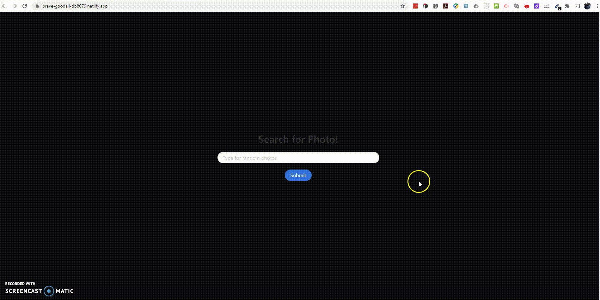

## Why Serverless Architecture?

Hosting a software application on the internet usually involves managing some kind of server infrastructure. Typically this means a virtual or physical server that needs to be managed, as well as the operating system and other web server hosting processes required for your application to run. Using a virtual server from a cloud provider such as Amazon or Microsoft does mean the elimination of the physical hardware concerns, but still requires some level of management of the operating system and the web server software processes.

With a serverless architecture, you focus purely on the individual functions in your application code. Services such as Twilio Functions, AWS Lambda and Microsoft Azure Functions take care of all the physical hardware, virtual machine operating system, and web server software management. You only need to worry about your code.

## Who Should Use Serverless?

You should especially consider using a serverless provider if you have a small number of functions that you need hosted. If your application is more complex, a serverless architecture can still be beneficial, but you will need to architect your application very differently. This may not be feasible if you have an existing application. It may make more sense to migrate small pieces of the application into serverless functions over time.

Using a product like Twilio Functions is especially helpful for builders and developers wanting to implement a Twilio solution. They are able to select pre-defined templates and deploy common communications use-cases without the need to host a server or use any other providers.

## Serverless App

This is a quick demo to show how serverless application work.
I have created a simple search photo form where user can search for any random photo of subject.
There is no server configure in backend. The front end search photo using unsplash API Service.

<p align="center">
  <a href="https://brave-goodall-db8079.netlify.app/">
    
  </a>
</p>

---
 <p align="center">
    <a href="https://brave-goodall-db8079.netlify.app/">View Demo</a>
    ·
    <a href="https://github.com/riteshprk/serverless-functions/issues">Report Bug</a>
    ·
    <a href="https://github.com/riteshprk/serverless-functions/issues">Request Feature</a>
  </p>


#### Tech Stack

| Stack    | -                                                                                                  | -                                                                                                 | -                                                                                                 | 
| -------- | -------------------------------------------------------------------------------------------------- | ------------------------------------------------------------------------------------------------- | ------------------------------------------------------------------------------------------------- | 
| FrontEnd | <p align="center"> <br />HTML</p> | <p align="center"> <br />CSS</p>  |  <p align="center"> <br />JavaScript</p>  | 
| BackEnd  | <p>No backend :)</p>   | 


#### :rocket: Quick start
Create the project and function file
On your computer, create a new folder for the functions to live in:

## create a new folder
```
mkdir serverless-functions
```

## move into the new folder
```
cd serverless-functions/
```
Next, make a functions folder in the new folder:

## create a directory called functions
```
mkdir functions
```
Inside the functions folder, create a new file called hello-world.js—this will be your serverless function:

## create the file for your first serverless function
```
touch functions/hello-world.js
```
Inside hello-world.js, add the following code:
```
exports.handler = async () => {
  return {
    statusCode: 200,
    body: 'Hello world!',
  };
};
```

This is a complete serverless function. No joke. This JavaScript function returns an HTTP status code of 200 (for “OK”) and a plain text body of “Hello world!”

Now that we’ve created the serverless function, let’s get set up to test it locally.

Set up Netlify
First, install the Netlify CLI on your computer and log in to make sure that you have access to your Netlify account:

## install the Netlify CLI 
```
npm i -g netlify-cli 
```

## log into your Netlify account 
```
ntl login
```
Note: If you don’t already have a Netlify account, you can set one up for free using your GitHub, GitLab, Bitbucket, or email address in a few seconds.

Next, create netlify.toml at the root of your project:

## create a Netlify config file in the project root 
```
touch netlify.toml
```
Inside netlify.toml, configure Netlify Functions by adding two lines of config:
```
[build]
  functions = "functions"
```
This tells Netlify that you want to enable Netlify Functions and that it should look in the functions folder to find them. Once you’ve set this, Netlify will do the rest!

Start the server
You have access to a local development server called Netlify Dev that supports serverless functions. To run it, you’ll use the CLI:
```
ntl dev
```


---

Made with ❤️ and JS