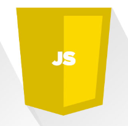

# Why Serverless Architecture?

Hosting a software application on the internet usually involves managing some kind of server infrastructure. Typically this means a virtual or physical server that needs to be managed, as well as the operating system and other web server hosting processes required for your application to run. Using a virtual server from a cloud provider such as Amazon or Microsoft does mean the elimination of the physical hardware concerns, but still requires some level of management of the operating system and the web server software processes.

With a serverless architecture, you focus purely on the individual functions in your application code. Services such as Twilio Functions, AWS Lambda and Microsoft Azure Functions take care of all the physical hardware, virtual machine operating system, and web server software management. You only need to worry about your code.

# Who Should Use Serverless?

You should especially consider using a serverless provider if you have a small number of functions that you need hosted. If your application is more complex, a serverless architecture can still be beneficial, but you will need to architect your application very differently. This may not be feasible if you have an existing application. It may make more sense to migrate small pieces of the application into serverless functions over time.

Using a product like Twilio Functions is especially helpful for builders and developers wanting to implement a Twilio solution. They are able to select pre-defined templates and deploy common communications use-cases without the need to host a server or use any other providers.

# Serverless App

This is a quick demo to show how serverless application work.
I have created a simple search photo form where user can search for any random photo of subject.
There is no server configure in backend. The front end search photo using unsplash API Service.

<p align="center">
  <a href="https://brave-goodall-db8079.netlify.app/">
    
  </a>
</p>

---
 <p align="center">
    <a href="https://brave-goodall-db8079.netlify.app/">View Demo</a>
    ·
    <a href="https://github.com/riteshprk/serverless-functions/issues">Report Bug</a>
    ·
    <a href="https://github.com/riteshprk/serverless-functions/issues">Request Feature</a>
  </p>

## ✨ Features

- Categories display and search
- Quantity and Size selection
- Modify cart
- Discont coupon 
- Payment method- Stripe and Paypal
- Order confirmation and Order history
- User account handling

## Tech Stack

| Stack    | -                                                                                                  | -                                                                                                 | -                                                                                                 | 
| -------- | -------------------------------------------------------------------------------------------------- | ------------------------------------------------------------------------------------------------- | ------------------------------------------------------------------------------------------------- | 
| FrontEnd | <p align="center"> <br />HTML</p> | <p align="center"> <br />CSS</p>  |  <p align="center"> <br />JavaScript</p>  | 
| BackEnd  | <p align="center"> <br />Python</p>   | <p align="center"> <br />Django</p> |


## :rocket: Quick start

Start developing locally.

To get this project up and running you should start by having Python installed on your computer. It's advised you create a virtual environment to store your projects dependencies separately. You can install virtualenv with

```
pip install virtualenv
```

Clone or download this repository and open it in your editor of choice. In a terminal (mac/linux) or windows terminal, run the following command in the base directory of this project

```
virtualenv env
```

That will create a new folder `env` in your project directory. Next activate it with this command on mac/linux:

```
source env/bin/active
```

Then install the project dependencies with

```
pip install -r requirements.txt
```

Now you can run the project with this command

```
python manage.py runserver
```

**Note** if you want Stripe and Paypal payments to work you will need to enter your own Stripe API keys and Paypal account into the `.env` file in the settings files.


---

Made with ❤️ and JS and Bulma